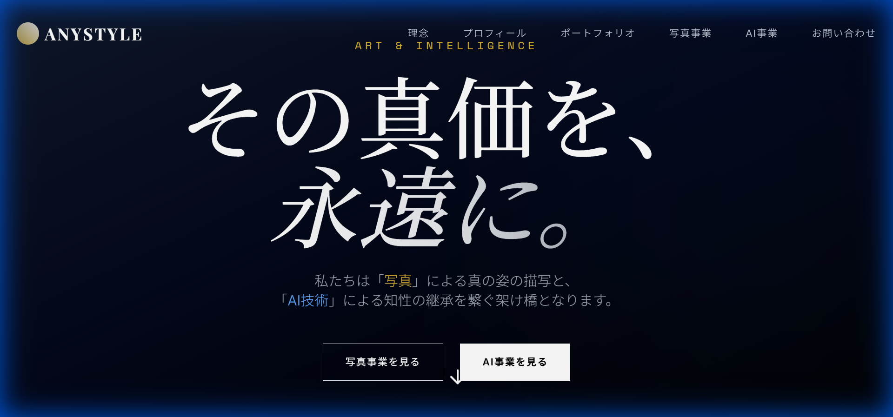
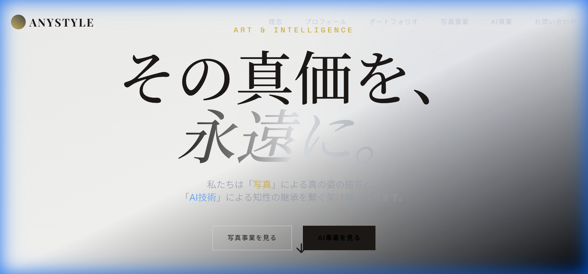
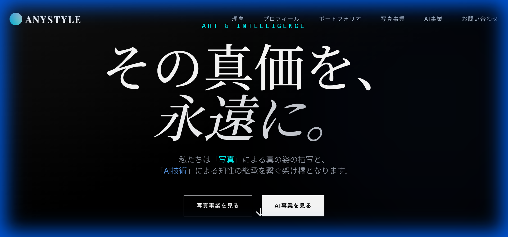
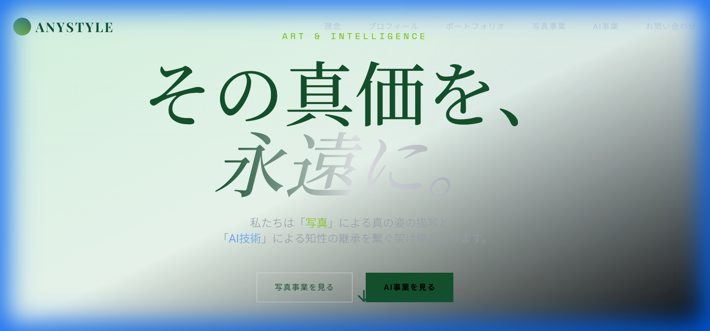

# Color Scheme Options

Here are 4 color scheme variations for the homepage.

## 1. Original (Dark/Gold)
The current design.
- **Background**: Dark Slate
- **Text**: White
- **Accents**: Gold

## 2. Light/Elegant
A clean, sophisticated look suitable for high-end corporate clients.
- **Background**: Warm White / Cream
- **Text**: Dark Warm Gray
- **Accents**: Gold

## 3. Modern/Vibrant
A high-tech, futuristic look with neon accents.
- **Background**: Black
- **Text**: White
- **Accents**: Cyan & Electric Purple

## 4. Nature/Calm
A fresh, organic look emphasizing growth and harmony.
- **Background**: Very Light Green
- **Text**: Dark Green
- **Accents**: Lime Green

---
**Note**: The `index.html` has been updated to use CSS variables, making it easy to switch between these themes by simply updating the `:root` variables.
